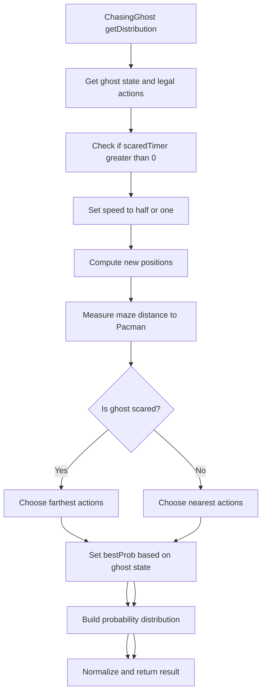

```mermaid
graph TD
    CG_Start[ChasingGhost getDistribution]
    CG_1[Get ghost state and legal actions]
    CG_2[Check if scaredTimer greater than 0]
    CG_3[Set speed to half or one]
    CG_4[Compute new positions]
    CG_5[Measure maze distance to Pacman]
    CG_6{Is ghost scared?}
    CG_7a[Choose farthest actions]
    CG_7b[Choose nearest actions]
    CG_8[Set bestProb based on ghost state]
    CG_9[Build probability distribution]
    CG_10[Normalize and return result]

    CG_Start --> CG_1 --> CG_2 --> CG_3 --> CG_4 --> CG_5 --> CG_6
    CG_6 -- Yes --> CG_7a --> CG_8 --> CG_9 --> CG_10
    CG_6 -- No  --> CG_7b --> CG_8 --> CG_9 --> CG_10
```