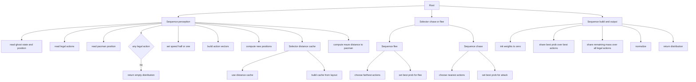

```mermaid
flowchart TD
    CG_Root[Root]

    %% Perception
    CG_Root --> CG_SeqPerception[Sequence perception]
    CG_SeqPerception --> CG_ReadState[read ghost state and position]
    CG_SeqPerception --> CG_ReadActions[read legal actions]
    CG_SeqPerception --> CG_ReadPacman[read pacman position]
    CG_SeqPerception --> CG_CheckAny{any legal action}
    CG_CheckAny -- no --> CG_ReturnEmpty[return empty distribution]
    CG_SeqPerception --> CG_Speed[set speed half or one]
    CG_SeqPerception --> CG_Vectors[build action vectors]
    CG_SeqPerception --> CG_NewPos[compute new positions]
    CG_SeqPerception --> CG_CacheSel[Selector distance cache]
    CG_CacheSel --> CG_UseCache[use distance cache]
    CG_CacheSel --> CG_BuildCache[build cache from layout]
    CG_SeqPerception --> CG_Dists[compute maze distance to pacman]

    %% Decision via selector
    CG_Root --> CG_ModeSel[Selector chase or flee]
    CG_ModeSel --> CG_SeqFlee[Sequence flee]
    CG_SeqFlee --> CG_Farthest[choose farthest actions]
    CG_SeqFlee --> CG_BestProbFlee[set best prob for flee]

    CG_ModeSel --> CG_SeqChase[Sequence chase]
    CG_SeqChase --> CG_Nearest[choose nearest actions]
    CG_SeqChase --> CG_BestProbAttack[set best prob for attack]

    %% Build and output
    CG_Root --> CG_SeqBuild[Sequence build and output]
    CG_SeqBuild --> CG_InitWeights[init weights to zero]
    CG_SeqBuild --> CG_ShareBest[share best prob over best actions]
    CG_SeqBuild --> CG_ShareRest[share remaining mass over all legal actions]
    CG_SeqBuild --> CG_Normalize[normalize]
    CG_SeqBuild --> CG_Return[return distribution]


```