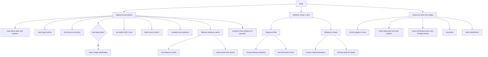

```mermaid
flowchart TD
    DG_Root[Root]

    %% Perception
    DG_Root --> DG_SeqPerception[Sequence perception]
    DG_SeqPerception --> DG_ReadState[read ghost state and position]
    DG_SeqPerception --> DG_ReadActions[read legal actions]
    DG_SeqPerception --> DG_ReadPacman[read pacman position]
    DG_SeqPerception --> DG_CheckAny{any legal action}
    DG_CheckAny -- no --> DG_ReturnEmpty[return empty distribution]
    DG_SeqPerception --> DG_Speed[set speed half or one]
    DG_SeqPerception --> DG_Vectors[build action vectors]
    DG_SeqPerception --> DG_NewPos[compute new positions]
    DG_SeqPerception --> DG_CacheSel[Selector distance cache]
    DG_CacheSel --> DG_UseCache[use distance cache]
    DG_CacheSel --> DG_BuildCache[build cache from layout]
    DG_SeqPerception --> DG_Dists[compute maze distance to pacman]

    %% Decision via selector
    DG_Root --> DG_ModeSel[Selector chase or flee]
    DG_ModeSel --> DG_SeqFlee[Sequence flee]
    DG_SeqFlee --> DG_Farthest[choose farthest positions]
    DG_SeqFlee --> DG_BestProbFlee[set best prob for flee]

    DG_ModeSel --> DG_SeqChase[Sequence chase]
    DG_SeqChase --> DG_Nearest[choose nearest positions]
    DG_SeqChase --> DG_BestProbAttack[set best prob for attack]

    %% Build and output
    DG_Root --> DG_SeqBuild[Sequence build and output]
    DG_SeqBuild --> DG_InitWeights[init all weights to zero]
    DG_SeqBuild --> DG_ShareBest[share best prob over best actions]
    DG_SeqBuild --> DG_ShareRest[share remaining mass over all legal actions]
    DG_SeqBuild --> DG_Normalize[normalize]
    DG_SeqBuild --> DG_Return[return distribution]


```
