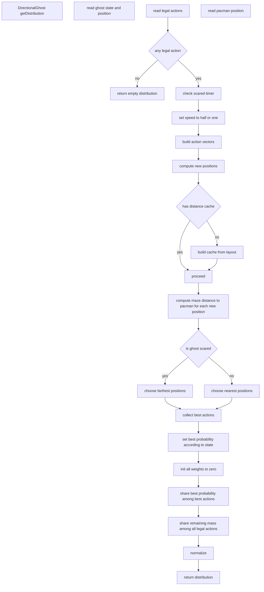

```mermaid
graph TD
    DG_Start[DirectionalGhost getDistribution]
    DG_1[read ghost state and position]
    DG_2[read legal actions]
    DG_3[read pacman position]
    DG_2 --> DG_has{any legal action}
    DG_has -- no --> DG_ret[return empty distribution]
    DG_has -- yes --> DG_4[check scared timer]
    DG_4 --> DG_5[set speed to half or one]
    DG_5 --> DG_6[build action vectors]
    DG_6 --> DG_7[compute new positions]
    DG_7 --> DG_cache{has distance cache}
    DG_cache -- no --> DG_build[build cache from layout]
    DG_cache -- yes --> DG_go[proceed]
    DG_build --> DG_go
    DG_go --> DG_8[compute maze distance to pacman for each new position]
    DG_8 --> DG_scared{is ghost scared}
    DG_scared -- yes --> DG_far[choose farthest positions]
    DG_scared -- no  --> DG_near[choose nearest positions]
    DG_far --> DG_best[collect best actions]
    DG_near --> DG_best
    DG_best --> DG_p[set best probability according to state]
    DG_p --> DG_w0[init all weights to zero]
    DG_w0 --> DG_wb[share best probability among best actions]
    DG_wb --> DG_wr[share remaining mass among all legal actions]
    DG_wr --> DG_norm[normalize]
    DG_norm --> DG_out[return distribution]

```
