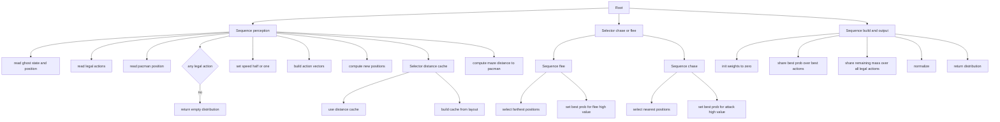

```mermaid
flowchart TD
    IG_Root[Root]

    %% Perception
    IG_Root --> IG_SeqPerception[Sequence perception]
    IG_SeqPerception --> IG_ReadState[read ghost state and position]
    IG_SeqPerception --> IG_ReadActions[read legal actions]
    IG_SeqPerception --> IG_ReadPacman[read pacman position]
    IG_SeqPerception --> IG_CheckAny{any legal action}
    IG_CheckAny -- no --> IG_ReturnEmpty[return empty distribution]
    IG_SeqPerception --> IG_Speed[set speed half or one]
    IG_SeqPerception --> IG_Vectors[build action vectors]
    IG_SeqPerception --> IG_NewPos[compute new positions]
    IG_SeqPerception --> IG_CacheSel[Selector distance cache]
    IG_CacheSel --> IG_UseCache[use distance cache]
    IG_CacheSel --> IG_BuildCache[build cache from layout]
    IG_SeqPerception --> IG_Dists[compute maze distance to pacman]

    %% Decision via selector
    IG_Root --> IG_ModeSel[Selector chase or flee]
    IG_ModeSel --> IG_SeqFlee[Sequence flee]
    IG_SeqFlee --> IG_Farthest[select farthest positions]
    IG_SeqFlee --> IG_BestProbFlee[set best prob for flee high value]

    IG_ModeSel --> IG_SeqChase[Sequence chase]
    IG_SeqChase --> IG_Nearest[select nearest positions]
    IG_SeqChase --> IG_BestProbAttack[set best prob for attack high value]

    %% Build and output
    IG_Root --> IG_SeqBuild[Sequence build and output]
    IG_SeqBuild --> IG_InitWeights[init weights to zero]
    IG_SeqBuild --> IG_ShareBest[share best prob over best actions]
    IG_SeqBuild --> IG_ShareRest[share remaining mass over all legal actions]
    IG_SeqBuild --> IG_Normalize[normalize]
    IG_SeqBuild --> IG_Return[return distribution]


```