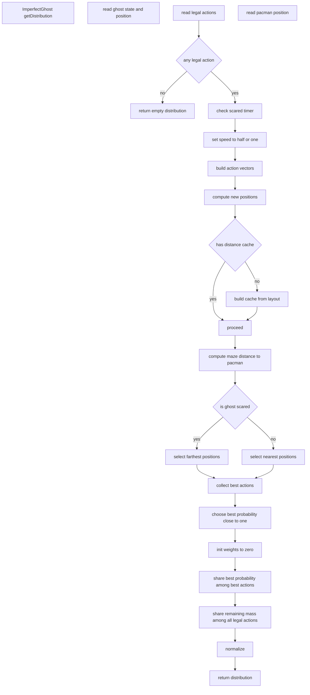

```mermaid
graph TD
    IG_Start[ImperfectGhost getDistribution]
    IG_1[read ghost state and position]
    IG_2[read legal actions]
    IG_3[read pacman position]
    IG_2 --> IG_has{any legal action}
    IG_has -- no --> IG_ret[return empty distribution]
    IG_has -- yes --> IG_sc[check scared timer]
    IG_sc --> IG_spd[set speed to half or one]
    IG_spd --> IG_vec[build action vectors]
    IG_vec --> IG_pos[compute new positions]
    IG_pos --> IG_cache{has distance cache}
    IG_cache -- no --> IG_build[build cache from layout]
    IG_cache -- yes --> IG_go[proceed]
    IG_build --> IG_go
    IG_go --> IG_dist[compute maze distance to pacman]
    IG_dist --> IG_q{is ghost scared}
    IG_q -- yes --> IG_far[select farthest positions]
    IG_q -- no  --> IG_near[select nearest positions]
    IG_far --> IG_best[collect best actions]
    IG_near --> IG_best
    IG_best --> IG_bp[choose best probability close to one]
    IG_bp --> IG_init[init weights to zero]
    IG_init --> IG_bestshare[share best probability among best actions]
    IG_bestshare --> IG_restshare[share remaining mass among all legal actions]
    IG_restshare --> IG_norm[normalize]
    IG_norm --> IG_out[return distribution]

```