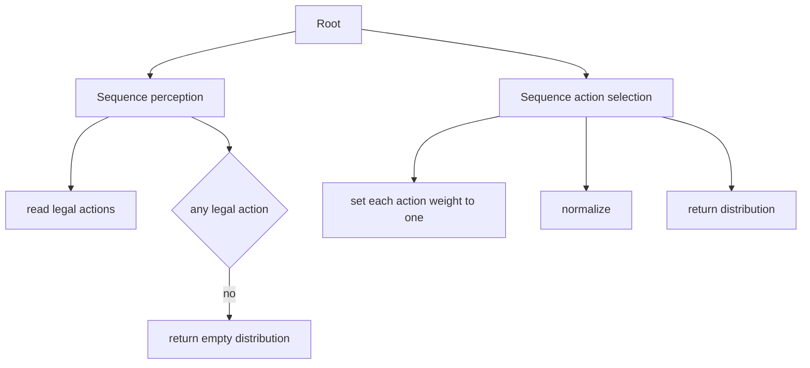

```mermaid
flowchart TD
    RG_Root[Root]
    RG_Root --> RG_SeqPerception[Sequence perception]
    RG_SeqPerception --> RG_ReadActions[read legal actions]
    RG_SeqPerception --> RG_CheckAny{any legal action}
    RG_CheckAny -- no --> RG_ReturnEmpty[return empty distribution]

    RG_Root --> RG_SeqAct[Sequence action selection]
    RG_SeqAct --> RG_UniformInit[set each action weight to one]
    RG_SeqAct --> RG_Normalize[normalize]
    RG_SeqAct --> RG_Return[return distribution]


```
