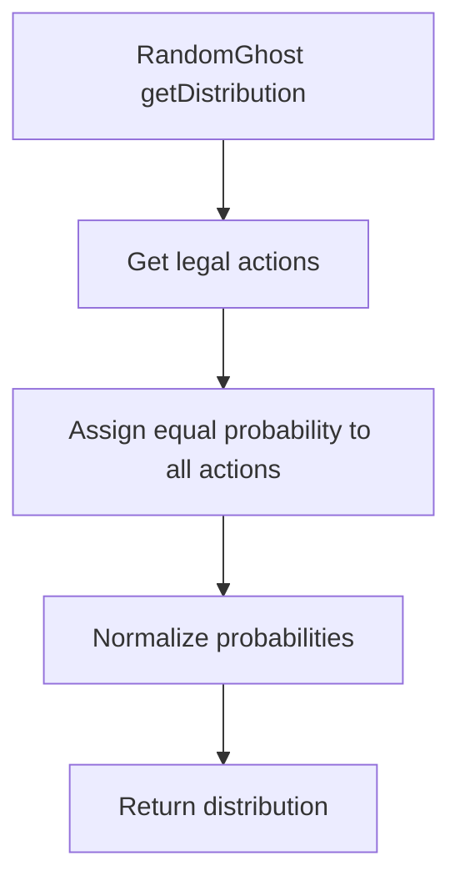

```mermaid
graph TD
    RG_Start[RandomGhost getDistribution]
    RG_A[Get legal actions]
    RG_B[Assign equal probability to all actions]
    RG_C[Normalize probabilities]
    RG_D[Return distribution]

    RG_Start --> RG_A --> RG_B --> RG_C --> RG_D


```
