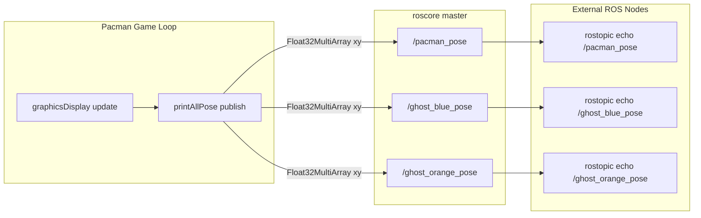

```mermaid

flowchart LR
  subgraph Game["Pacman Game Loop"]
    u["graphicsDisplay update"]
    p["printAllPose publish"]
    u --> p
  end

  %% edge labels kept simple (no brackets or quotes)
  p -- Float32MultiArray xy --> t_pac["/pacman_pose"]
  p -- Float32MultiArray xy --> t_blue["/ghost_blue_pose"]
  p -- Float32MultiArray xy --> t_orange["/ghost_orange_pose"]

  subgraph ROS["roscore master"]
    t_pac
    t_blue
    t_orange
  end

  subgraph External["External ROS Nodes"]
    echo_p["rostopic echo /pacman_pose"]
    echo_b["rostopic echo /ghost_blue_pose"]
    echo_o["rostopic echo /ghost_orange_pose"]
  end

  t_pac --> echo_p
  t_blue --> echo_b
  t_orange --> echo_o

```